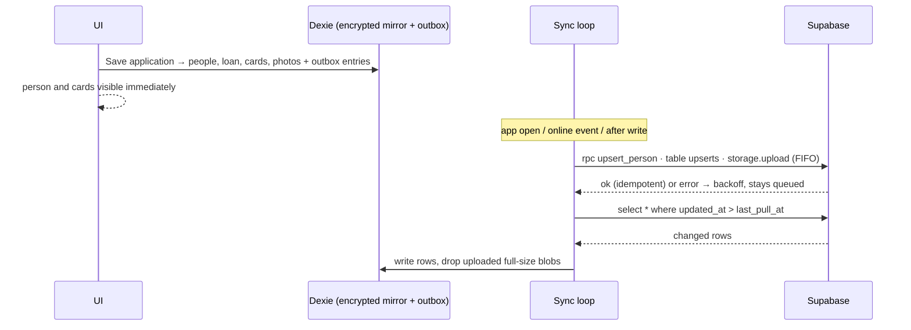

# Loan Ledger App — Implementation Plan

Draft v3 · 2026-09-05 · Admin-only. Data model mirrors the paper **ऋण आवेदन पत्र / Loan Application Form**. Greenfield, nothing built yet.

---

## Status (2026-09-05): built

Phase 1 is implemented in this repo (see README.md for setup). Decisions made while building:

- **Admin login is email + password** (Supabase Auth, free, no SMS provider needed). Phone-OTP login for the admin can be added later with an Indian SMS provider and DLT registration; it was not worth the paperwork for one or two admins.
- **Borrower OTP uses Firebase Phone Auth** (free within Google's monthly quota, Google delivers the SMS in India, no DLT). Only the borrower's number needs verification; the same Verify button also works on any other mobile field.
- **No edge functions.** The admin is the only trusted user, so the verification result is written by the app after Firebase confirms the code; the server still enforces admin-only access through RLS.
- Not exercised here: the SQL migration was written but not run (no Docker on this machine); the camera capture and Firebase flows need a real phone and real keys.

---

## 1. What we are building

A **mobile-first Progressive Web App (PWA)** for a money lender in India. The borrower fills the paper form and signs it. The lender (admin) then:

1. Signs in with **phone OTP**.
2. Opens **New application** and types the paper form into the app, section by section, in the same order as the paper.
3. **Verifies the borrower's and co-borrower's mobile numbers** by sending an OTP that the borrower reads back.
4. Takes **photos**: the person, the front and back of the ID they gave, and the **signed paper form**.
5. Saves. The app creates one **monthly card** per installment.
6. Later, browses **every person he has lent to**, all their details and photos, and per loan the **monthly cards showing paid / not paid** with **Mark paid** and **Undo**.

Data lives in two places: **Postgres on the server** (source of truth) and an **encrypted local database on the phone** (full mirror plus an outbox), so the app works while visiting borrowers with bad or no network. The same codebase is wrapped with Capacitor later for a private Android app.

**Out of scope:** borrower-facing screens, online collection, credit bureau, e-KYC vendor APIs. Listed as later options in §11.

---

## 2. The paper form → the app

| Paper section            | Fields on paper                                                                                                                                | In the app                                                                                               |
| ------------------------ | ---------------------------------------------------------------------------------------------------------------------------------------------- | -------------------------------------------------------------------------------------------------------- |
| 1. Loan details          | Loan/Customer No., Loan Amount, Loan Date, Loan Tenure (months), Monthly Installment, Total Repayment Amount                                   | `loans` row. Total defaults to installment × months, editable. Cards generated from these.               |
| 2. Borrower details      | Name, Any one ID (Aadhaar / PAN / Voter ID / DL), Mobile, Address                                                                              | `people` row, `id_type` + `id_number`, phone with **Verify** button, photos of person and ID.            |
| 3. Co-borrower details   | Same four                                                                                                                                      | Second `people` row, optional. Same Verify and photos.                                                   |
| 4. Occupation & business | Borrower occupation, Co-borrower occupation, Business/Workplace name, Business/Work address, Business/Workplace mobile, Approx. monthly income | Occupations on each `people` row; the business block on the `loans` row.                                 |
| 5. References            | Two rows of Name, Mobile, Full address                                                                                                         | Six columns on `loans`. Verify button available on their mobiles too.                                    |
| 6. Self declaration      | Hindi declaration, borrower and co-borrower signature / thumb impression, dates                                                                | **Photo of the signed page** stored as a `signed_form` document on the loan. This is the consent record. |

**One difference from your first brief:** the paper has one address per person plus a business address, not current and permanent. The plan follows the paper. A permanent-address field is one extra column if you want it.

---

## 3. What the brief and form leave open — defaults chosen

| #   | Open point                                                                              | Default in this plan                                                                                                                                            | Ask?    |
| --- | --------------------------------------------------------------------------------------- | --------------------------------------------------------------------------------------------------------------------------------------------------------------- | ------- |
| 1   | **Loan / Customer No.**: written by hand today. Should the app propose the next number? | Text field, prefilled with the next number from existing loans, editable, unique.                                                                               | **Ask** |
| 2   | **First installment due date**: the form has only Loan Date.                            | Loan date + 1 month, shown as an editable field.                                                                                                                | **Ask** |
| 3   | **Partial payments** and **late fees**                                                  | Partial allowed (amount prefilled with the installment). No late fee; a note per card.                                                                          | **Ask** |
| 4   | **Which numbers get OTP-verified**                                                      | Borrower and co-borrower expected; references and business mobile optional. Same button everywhere.                                                             | **Ask** |
| 5   | **How many admins / devices**                                                           | Allowlist of admin phone numbers; phone and laptop both fine.                                                                                                   | **Ask** |
| 6   | **Language**                                                                            | Labels in English as on the form, Hindi headings where the paper has them. Strings externalised; full Hindi UI in Phase 2.                                      | **Ask** |
| 7   | **Store the full ID number**                                                            | Encrypted with a server-held key, shown as last 4, full number on tap (logged). For Aadhaar specifically, be ready to keep last 4 only if legal advice says so. | **Ask** |
| 8   | **Reminders / receipts** to borrowers                                                   | None in MVP. Phase 2: SMS before due date and SMS receipt on Mark paid.                                                                                         | **Ask** |
| 9   | **Existing borrowers** to bring in                                                      | None assumed; CSV import is cheap if a spreadsheet exists.                                                                                                      | **Ask** |
| 10  | **Person photo**                                                                        | Not on the paper, but you asked for it. Kept as a required tile.                                                                                                | No      |
| 11  | **ID back side**                                                                        | Aadhaar, Voter ID and DL have a back; PAN does not. Back tile shown only for those.                                                                             | No      |
| 12  | **Offline scope**                                                                       | Everything except login and sending OTPs.                                                                                                                       | No      |
| 13  | **Deleting data**                                                                       | Closed loans keep records. A person is deleted only on explicit admin action; photos go with them.                                                              | No      |

---

## 4. Users

One role: **admin**. Every signed-in user must be in the `admins` allowlist; Row Level Security (RLS) denies everything to anyone else. Self-signup is disabled; admins are created from the Supabase dashboard. Borrowers are **records, not accounts**.

---

## 5. Architecture and stack

**Principle:** one React codebase, Postgres as source of truth, the phone as a full encrypted mirror with an outbox. No custom backend server; the little server logic lives in SQL functions and two tiny edge functions.

```
Admin phone (PWA / later Capacitor)                Supabase project (Mumbai region)
┌─────────────────────────────────┐               ┌────────────────────────────────────┐
│ React + TypeScript + Vite       │ HTTPS / JWT   │ Postgres, RLS = is_admin()          │
│ react-hook-form + zod           │◄─────────────►│  people · loans · installments       │
│ Dexie (IndexedDB, AES-GCM)      │               │  documents · phone_verifications     │
│   mirror of all tables + outbox │               │  admins · audit_log                  │
│ sync loop                       │               │  pgcrypto + Vault (ID numbers)       │
│ Service worker (app shell)      │               │ Auth: phone OTP for admins           │
└─────────────────────────────────┘               │ Storage: private bucket `docs`       │
                                                  │ Edge fns: send-sms-hook, verify-phone│
                                                  └────────────────────────────────────┘
                                                              │ MSG91 (DLT-registered SMS)
        shared/ — zod schemas + validators used by the browser and the edge function
```

### Frontend

- **React 19 + TypeScript (strict) + Vite**, `vite-plugin-pwa` (app-shell precache, offline fallback, update prompt).
- **react-hook-form + zod**; schemas in `shared/` so the same rules run everywhere.
- **Dexie** (IndexedDB): mirror of `people`, `loans`, `installments`, `documents`, `phone_verifications`, plus `drafts`, `outbox` and photo blobs. Drafts, outbox payloads and blobs encrypted with WebCrypto AES-GCM under a non-extractable per-device key.
- **Tailwind CSS** and a handful of hand-written components (Button, Input, Select, PhotoTile, Sheet, Card, SectionHeader).
- **react-i18next** with `locales/en.json`, `locales/hi.json`.
- **Capacitor** in Phase 3, same code.

### Backend: Supabase

- Region **ap-south-1 (Mumbai)**, data stays in India.
- **Auth**: phone OTP for admins, signups disabled. SMS via MSG91 through the Supabase Send-SMS auth hook (a 20-line edge function). Test numbers with a fixed OTP for dev and CI.
- **Phone verification**: edge function `verify-phone` with `action: send | verify`, proxying the MSG91 OTP API (it generates, expires and checks the code). On success it upserts `phone_verifications` server-side after checking the caller is an admin, so the client cannot fake a badge.
- **RLS on every table** through `is_admin()`. The service-role key never ships to the client. `people.id_number_enc` has `SELECT` revoked from the client role; readable only via `reveal_id()`.
- **Storage** bucket `docs`, private, paths `people/{person_id}/{type}-{uuid}.jpg` and `loans/{loan_id}/{type}-{uuid}.jpg`, policy `is_admin()`, 5-minute signed URLs.
- **SQL functions**: `upsert_person(jsonb)` (validates by ID type, encrypts the number, stores last 4 + HMAC for duplicate detection), `reveal_id(person_id)` (audited), `delete_person(person_id)`. Everything else is plain RLS-guarded table writes.
- **Audit trigger** on `people`, `loans`, `installments`, `documents`: who changed what, old and new. This is the payment history behind Undo.
- Migrations in `supabase/migrations`, local dev via `supabase start`, TS types via `supabase gen types`.

### Why this and not …

- **Firebase**: built-in offline sync, but a ledger wants relational constraints and one place to encrypt ID numbers; the data is tiny so mirror + outbox is ~100 lines.
- **Custom Node/Python API**: only re-implements auth, uploads and CRUD. Everything is plain Postgres, so leaving later is an export.
- **React Native / Flutter first**: the brief says website first. PWA now, Capacitor later, one codebase.

---

## 6. Data model

Amounts are whole rupees as `integer`. All IDs are **client-generated UUIDs** so offline-created rows can be retried safely. Every table has `created_at`, `updated_at` (trigger), `created_by`, `deleted_at` (soft delete, so deletions sync).

| Table                 | Columns                                                                                                                                                                                                                                                                                                                                                                                                         |
| --------------------- | --------------------------------------------------------------------------------------------------------------------------------------------------------------------------------------------------------------------------------------------------------------------------------------------------------------------------------------------------------------------------------------------------------------- |
| `admins`              | `user_id` (= `auth.users.id`), `name`, `phone`.                                                                                                                                                                                                                                                                                                                                                                 |
| `people`              | `full_name`, `phone` (E.164), `id_type` enum(aadhaar, pan, voter_id, driving_licence), `id_number_enc bytea`, `id_last4`, `id_hmac`, `address text`, `occupation`, `notes`.                                                                                                                                                                                                                                     |
| `loans`               | `loan_no` (text, unique), `borrower_id` → people, `co_borrower_id` → people (nullable), `amount`, `loan_date`, `tenure_months`, `installment_amount`, `total_repayment`, `first_due_date`, `business_name`, `business_address`, `business_mobile`, `monthly_income`, `ref1_name`, `ref1_phone`, `ref1_address`, `ref2_name`, `ref2_phone`, `ref2_address`, `status` enum(active, closed), `closed_on`, `notes`. |
| `installments`        | `loan_id`, `no`, `due_date`, `amount_due`, `paid_amount` (default 0), `paid_on`, `paid_mode` enum(cash, upi, bank, other), `note`, `marked_by`. Unique(loan_id, no). **One row = one monthly card.**                                                                                                                                                                                                            |
| `documents`           | `person_id` or `loan_id` (exactly one, CHECK), `type` enum(person_photo, id_front, id_back, signed_form, other), `storage_path`, `sha256`, `captured_at`, `caption`. Partial unique index on (person_id, type) for the fixed person types.                                                                                                                                                                      |
| `phone_verifications` | `phone` (PK), `verified_at`, `verified_by`, `person_id` (nullable, informational). Any phone field in the app shows a green badge if its number is here.                                                                                                                                                                                                                                                        |
| `audit_log`           | `actor_id`, `table_name`, `row_id`, `action`, `old jsonb`, `new jsonb`, `at`.                                                                                                                                                                                                                                                                                                                                   |

**Derived, not stored:** card status = `paid` if `paid_amount ≥ amount_due`, `partial` if `> 0`, `overdue` if unpaid and `due_date < today`, else `due`. Loan totals, next due, overdue count come from a `loan_summary` view. `loans.status` flips to `closed` by trigger when every card is fully paid.

**Card generation** (client, since loans are created offline): `tenure_months` rows; `amount_due = installment_amount` for all but the last, which is `total_repayment − installment_amount × (n−1)` so the cards always sum to the total on the paper; `due_date = first_due_date + (no−1) months` (month-end clamped).

**Validation by ID type** (`shared/validators.ts`): Aadhaar 12 digits, first digit 2–9, **Verhoeff checksum**; PAN `^[A-Z]{3}P[A-Z][0-9]{4}[A-Z]$`; Voter ID `^[A-Z]{3}[0-9]{7}$`; DL loose (state formats vary): 10–16 letters/digits, warn but allow. Phone `^[6-9][0-9]{9}$`. Reference phones must differ from borrower and co-borrower. Loan: amount > 0, 1 ≤ tenure ≤ 120, installment > 0, total within one installment of installment × tenure (warn otherwise).

---

## 7. Screens (6)

| #   | Screen                 | What it does                                                                                                                                                                                                                                                                                                                                                                                                                                                                                                            |
| --- | ---------------------- | ----------------------------------------------------------------------------------------------------------------------------------------------------------------------------------------------------------------------------------------------------------------------------------------------------------------------------------------------------------------------------------------------------------------------------------------------------------------------------------------------------------------------- |
| 1   | **Login**              | +91 phone → OTP (auto-fills via WebOTP on Android, `one-time-code` on iOS).                                                                                                                                                                                                                                                                                                                                                                                                                                             |
| 2   | **People list** (home) | Search by name, phone or loan no. Filter chips _All · Unpaid this month · Overdue_. Row: name, phone, active-loan installment, this month's status dot. "Unfinished applications" strip at the top if drafts exist. Sync pill ("3 changes waiting"). FAB **New application**.                                                                                                                                                                                                                                           |
| 3   | **New application**    | One scrolling form in the **exact order of the paper**, with sticky section headers 1–6. Borrower and co-borrower sections start with "Search existing person" so repeat customers are prefilled. Every mobile field has a **Verify** button (OTP sheet; greyed offline). Photo tiles inline: person, ID front, ID back (hidden for PAN); section 6 has the **signed form** tile. Auto-saves a local draft on every change. **Save** creates or updates the people rows, the loan and its cards, and queues the photos. |
| 4   | **Person detail**      | All fields, ID masked with tap-and-hold reveal (logged), phone badge, photo tiles (tap for full size, retake), loans list, edit, delete.                                                                                                                                                                                                                                                                                                                                                                                |
| 5   | **Loan detail**        | Summary strip: amount, total, paid, remaining, next due, overdue count. Then one **card per month**: "Feb 2027 · ₹5,000 · Due 5 Feb" → **Mark paid** opens a sheet (amount prefilled, date = today, mode, note) → card turns green "Paid 3 Feb · cash". **Undo** on a paid card. Overdue cards red. Below the cards: business block, references, signed-form photo, notes, edit.                                                                                                                                        |
| 6   | **Settings**           | Admins, CSV export, language, logout (wipes local data).                                                                                                                                                                                                                                                                                                                                                                                                                                                                |

---

## 8. Core flows

### 8.1 Admin login

`signInWithOtp({ phone })` → SMS via the Send-SMS hook → `verifyOtp()` → session (1 h access token, 30-day rotating refresh). OTP valid 5 min, resend after 60 s, attempt limits by Supabase. Unknown numbers get "not registered". After login the app pulls the full mirror.

### 8.2 Mobile number verification

Admin taps **Verify** next to any mobile field → `verify-phone {action:"send", phone}` → MSG91 SMS: "‹Lender› is recording your number for a loan application. Code: 123456. Share only with ‹Lender›." → borrower reads it out → admin types it → `verify-phone {action:"verify", phone, code, personId?}` → edge function checks the admin JWT, verifies with MSG91, upserts `phone_verifications`. Badge appears everywhere that number is shown. Verification never blocks saving; unverified numbers show a grey badge so the admin can verify later.

### 8.3 Photos

- `<input type="file" accept="image/*" capture="environment">` for documents and the signed form, `capture="user"` for the person photo. Phase 2 adds a live viewfinder with a card outline.
- Before saving: apply EXIF orientation, resize to ≤1600 px, JPEG ~0.8 via Canvas (≈200–500 KB), sha256 for dedupe. The re-encode strips EXIF/GPS.
- Stored encrypted in Dexie with a 200 px thumbnail, `uploaded=false`, plus an outbox entry. After upload the full-size local copy is deleted; the thumbnail stays so detail screens work offline. Full size via signed URL when online.
- Retake replaces the row for that type; the old object is deleted from storage. The signed form allows several pages.

### 8.4 Offline-first sync — "data in two places"

The admin's device is the only writer, so there is nothing to merge. Rule: **write locally first, queue, push, then re-pull.**

- **Mirror**: Dexie copies of the server tables minus `id_number_enc`. Every screen reads from Dexie only (`useLiveQuery`), so the UI is instant and works offline.
- **Drafts**: the New-application form state is written to Dexie on every change; killing the app loses nothing.
- **Outbox**: every change appends `{ id, op, payload, attempts }`, `op ∈ upsert_person · upsert_loan · upsert_installments · mark_installment · upload_document · delete_person`. Payloads carry the row's own UUID, so every op is idempotent and safe to retry.
- **Sync loop** on app open, on the browser `online` event, and debounced after each local write: push outbox FIFO (stop on first failure, exponential backoff, surface after 5 attempts) → pull every table where `updated_at > last_pull_at` → write into Dexie. `ponytail: full-table pull is fine at hundreds of rows; add per-table cursors if it ever exceeds a few seconds.`
- **ID numbers on the device**: the full number exists locally only inside the encrypted draft/outbox until `upsert_person` succeeds; afterwards the mirror holds `id_last4` only.
- **Two admin devices**: last write wins on `updated_at`; mark/unmark is idempotent. A duplicate `loan_no` from two offline devices is caught by the unique constraint on push and the app asks for a new number.
- `navigator.storage.persist()` is requested so the browser keeps the outbox. Logout wipes Dexie. iOS Safari can evict PWA storage after ~7 days of non-use, so the app syncs eagerly and the Capacitor build removes the risk.



### 8.5 Cards, Mark paid, Undo

- **Mark paid** sets `paid_amount, paid_on, paid_mode, note, marked_by`. **Undo** clears them. The audit trigger keeps every version, so history is never lost without a separate payments table. Add a `payments` ledger only if several partial payments per month become normal.
- **Closed** by trigger when all cards are fully paid; admin can also close early with a note (settled).
- The **Unpaid this month** filter is one query over `installments` where `due_date` is in the current month and `paid_amount < amount_due`. It is the collection list.

---

## 9. Security

- **RLS on every table** with `is_admin()`; storage policy the same; signups disabled; the allowlist is a second gate in case a setting is flipped.
- **Column privilege**: `id_number_enc` unreadable by the client role; `reveal_id()` is the only path and writes to `audit_log`.
- **Encryption**: ID numbers with a Vault-held key server-side; on the device, drafts, outbox payloads and blobs AES-GCM under a non-extractable WebCrypto key. Full-size photos deleted locally after upload. Logout wipes everything.
- **Validation**: zod in the browser for instant feedback; the same schema on the edge-function and RPC inputs; CHECK constraints in Postgres for formats.
- **OTP abuse**: MSG91 and Supabase rate limits; Cloudflare Turnstile on the login screen only if SMS pumping ever shows up.
- **Sessions**: rotating refresh tokens; 30-minute idle lock in the UI (PIN/biometric in the Capacitor build).
- **Transport/headers**: HTTPS, HSTS, strict CSP with hashed Vite assets, `Referrer-Policy: no-referrer`.
- **Logs**: no PII; Sentry with a `beforeSend` scrubber.
- **Backups**: daily backups with point-in-time recovery, one restore rehearsed before go-live, monthly bucket export for photos.

---

## 10. Compliance flags (engineering guidance, confirm with a lawyer / CA)

1. **Licence**: money-lender registration under the state Money Lenders Act, or NBFC. This is an internal ledger, not a consumer "digital lending app", so the RBI Digital Lending Directions mostly do not apply; data-in-India, consent and grievance basics still do.
2. **Aadhaar Act / UIDAI**: restrictions on storing and displaying Aadhaar numbers. Never print or export the full number; masked everywhere; encrypted storage with sign-off, or last 4 only. Voter ID, DL and PAN have no such rule but are treated the same way for simplicity.
3. **DPDP Act 2023**: notice and consent when collecting data. The signed paper declaration plus the OTP SMS text cover this; erasure on request via `delete_person`.
4. **TRAI DLT**: register the entity, a sender ID and both SMS templates (admin login OTP, borrower verification OTP) before any SMS to Indian numbers is delivered. Start in week 1.
5. **App store** (Phase 3): internal tool, so distribute the Android build privately (direct APK or Play internal track) to avoid the personal-loan-app policy review.

---

## 11. Repository layout, standards, tests

```
loan-ledger/
├── PLAN.md  README.md  .env.example  package.json  vite.config.ts  tsconfig.json
├── shared/            person.ts loan.ts validators.ts (verhoeff, pan, voterId, dl, pincode, phone) cards.ts
├── src/
│   ├── app/           router, providers, RequireAuth, SyncStatus
│   ├── components/    Button Input Select PhotoTile Sheet Card SectionHeader
│   ├── features/
│   │   ├── auth/      LoginScreen useSession
│   │   ├── people/    PeopleList PersonDetail PersonFields VerifyPhoneSheet
│   │   ├── loans/     NewApplication LoanDetail InstallmentCard MarkPaidSheet
│   │   └── settings/  SettingsScreen
│   ├── lib/           supabase.ts db.ts (dexie) sync.ts crypto.ts image.ts i18n.ts
│   └── locales/       en.json hi.json
├── supabase/
│   ├── config.toml  seed.sql
│   ├── migrations/    0001_schema.sql 0002_rls.sql 0003_functions.sql
│   ├── functions/     send-sms-hook/  verify-phone/
│   └── tests/         rls.test.sql (pgTAP)
└── e2e/               login.spec.ts offline-application.spec.ts (Playwright)
```

**Standards**

- TypeScript `strict`, no `any`; DB types generated. ESLint + Prettier in CI.
- Folder-by-feature. Components render; hooks own state; `lib/` talks to Dexie, Supabase and the camera. No business logic in components.
- One validation source in `shared/`; adding a field = one schema line + one label per locale + one column migration.
- `PersonFields` is one component used for borrower and co-borrower; `SectionHeader` numbers match the paper so the admin never hunts for a field.
- All reads from Dexie; all writes go local → outbox. No screen calls Supabase directly except login, phone verification and ID reveal.
- Migrations append-only, one per change. `seed.sql` creates one admin and two sample people for local dev.
- Money as integer rupees; dates as ISO `date` strings in `Asia/Kolkata`; never `Date` arithmetic across time zones.
- Errors: plain-language message in the user's language; Sentry gets the scrubbed stack; a failed push is shown as "waiting to sync", never as data loss.
- Accessibility on cheap phones: 44 px targets, 16 px+ text, `inputmode` on numeric fields, works on a 2 GB Android and iOS Safari.
- Dependencies (complete): react, react-dom, react-router, @supabase/supabase-js, react-hook-form, @hookform/resolvers, zod, dexie, dexie-react-hooks, i18next, react-i18next, tailwindcss, vite-plugin-pwa, @sentry/react. Dev: vite, typescript, eslint, prettier, vitest, playwright, supabase CLI.

**Tests**

| Layer    | Tool                         | Covers                                                                                                                                                                       |
| -------- | ---------------------------- | ---------------------------------------------------------------------------------------------------------------------------------------------------------------------------- |
| Unit     | Vitest                       | Validators per ID type (shared vectors); `cards.ts` sums to the paper total and clamps month-end due dates; sync loop against a fake network (retry, idempotency, ordering). |
| Database | pgTAP                        | Non-admin sees nothing; `id_number_enc` unreadable; close-loan trigger; audit rows written; `loan_no` unique.                                                                |
| E2E      | Playwright, mobile emulation | Login with test OTP; enter a full paper form **offline** with photos, mark two cards paid, go online, assert server state.                                                   |
| Manual   | Real devices                 | Low-end Android Chrome and iOS Safari: camera, PWA install, storage persistence, 2G sync.                                                                                    |

---

## 12. Delivery phases (one experienced React developer, full-time; about double at hobby pace)

**Phase 0 — Foundation (2 days)**
Repo, Supabase project in Mumbai, local Docker, migrations skeleton, CI, PWA shell on Cloudflare Pages with a custom domain, test-OTP login. Start DLT registration and the MSG91 account.

**Phase 1 — Everything on the paper form (≈3 weeks)**, build order:

1. Migrations: all seven tables, RLS, `upsert_person`, `reveal_id`, close-loan trigger, audit trigger, pgTAP tests.
2. Login screen, session, route guard, Send-SMS hook.
3. `shared/` schemas, validators, `cards.ts` with tests.
4. Dexie schema, crypto helper, sync loop, `SyncStatus` pill.
5. New-application form (sections 1–6, existing-person search, drafts) with `PersonFields`.
6. Photos: capture, resize, encrypt, thumbnails, upload op, PhotoTile.
7. `verify-phone` edge function + OTP sheet + badges.
8. People list with filters; Person detail with reveal, edit, delete.
9. Loan detail with cards, Mark paid / Undo sheet, close-loan.
10. Settings, CSV export, logout wipe, Sentry, Playwright offline path, real-device pass, go-live checklist (DLT live, backups, restore drill).

_Definition of done:_ on a real Android phone in airplane mode the admin enters a real filled paper form with four photos and the signed page, saves, and marks the first card paid; on reconnecting, everything is on the server and on a second device; RLS tests pass; the PWA installs from the browser; OTP verification works with a real number.

**Phase 2 — Polish (1–2 weeks)**
Full Hindi UI, SMS reminder before due date and SMS receipt on Mark paid (DLT templates), **filled-form PDF** that reproduces the paper layout for printing or WhatsApp, CSV import of existing borrowers, monthly collection summary on the home screen, live camera viewfinder with card outline, early-close/settlement flow.

**Phase 3 — Android app (1 week)**
`npx cap add android` around the same build: native camera, secure storage for session and device key, privacy-screen on ID screens, biometric/PIN lock, push notification for "N cards due today". Private distribution.

**Later, if ever:** borrower-facing status page, UPI Autopay / eNACH collection, PAN and Voter ID verification APIs, Offline Aadhaar / DigiLocker e-KYC, credit bureau.

---

## 13. Services and running cost (indicative)

| Service          | Use                                                           | Cost                     |
| ---------------- | ------------------------------------------------------------- | ------------------------ |
| Supabase Pro     | DB, auth, storage, edge functions, backups + PITR             | ~$25/mo                  |
| Cloudflare Pages | PWA hosting, CDN, HTTPS                                       | Free                     |
| MSG91            | Admin login OTP, number verification OTP, reminders (Phase 2) | ~₹0.20 per SMS after DLT |
| Sentry           | Error monitoring                                              | Free tier                |

---

## 14. Deliberate simplifications (and when to revisit)

| Kept simple                                                      | Upgrade when                                                                  |
| ---------------------------------------------------------------- | ----------------------------------------------------------------------------- |
| Installment and total typed in, no interest calculator           | You start quoting by interest rate instead of installment                     |
| Full-table pull on every sync, no cursors                        | Sync takes more than a few seconds (thousands of rows)                        |
| Payment on the installment row + audit log, no `payments` ledger | Several partial payments per month become normal                              |
| Last-write-wins between admin devices                            | A second admin edits the same person often                                    |
| Camera via file input, no viewfinder overlay                     | Document photos come back blurry or cropped often                             |
| One address per person, references as columns on the loan        | The paper form changes                                                        |
| All ID types encrypted the same way                              | Legal advice says Aadhaar last-4 only, or e-KYC lands                         |
| One role (`admin`)                                               | A collection agent needs Mark paid but not ID reveal → add `role` to `admins` |
